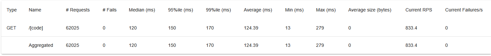
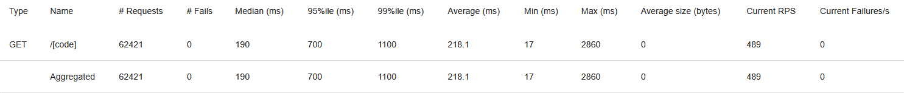

# URL Shortener

A production-minded URL shortener built to explore the systems-design problems that
make this "simple" app interesting at scale: sub-millisecond redirects, high-write
click analytics, caching, async job processing, rate limiting, and observability.

It ships as a full stack — a **FastAPI** backend, a **React** dashboard, and a
**Python CLI** — deployable to a single host behind Caddy with automatic TLS.

> This project doubles as a learning log. The engineering decisions and trade-offs
> behind each feature are written up day-by-day in [`devlog.md`](devlog.md).

---

## Highlights

- **Fast redirects, decoupled analytics.** Redirects resolve through a Redis
  cache-aside layer and enqueue a lightweight click event onto an
  [arq](https://arq-docs.helpmanual.io/) job queue, so the hot path stays
  sub-millisecond while a separate worker process drains writes to Postgres.
- **Measured, not guessed.** Load-tested with Locust; the cache cut latency
  dramatically under load (see [benchmarks](#benchmarks)). Query plans were
  inspected with `EXPLAIN ANALYZE` to justify a **partial unique index** on
  active short codes.
- **Correctness under retries.** Click ingestion is **idempotent** — each event
  carries a stable ID and inserts via Postgres `ON CONFLICT DO NOTHING`, so queue
  retries can't double-count.
- **Auth & abuse protection.** JWT authentication (bcrypt-hashed passwords) and
  per-user / per-IP **rate limiting** via SlowAPI.
- **Observability.** Structured JSON logging with `structlog`, plus a
  `request_id` propagated through every layer (via `contextvars`) to correlate a
  single request end-to-end.
- **Ships as a real deployment.** Dockerized services, Alembic migrations run
  automatically on startup, and a documented single-EC2 production setup behind
  Caddy.

## Architecture

```
                         ┌─────────────┐
   short domain  ─────►  │             │  307 redirect
   example.com/{code}    │   FastAPI   │◄────────────────  visitor
                         │     app     │
   app domain    ─────►  │             │  enqueue click ─┐
   app.example.com       └──────┬──────┘                 │
   (React dashboard,            │                        ▼
    /auth, /links API)          │                  ┌───────────┐
                                │  cache-aside     │   Redis   │
                                ├─────────────────►│  (cache + │
                                │                  │   queue)  │
                                ▼                  └─────┬─────┘
                          ┌───────────┐                 │ drains jobs
                          │ Postgres  │◄────────────────┤
                          │           │   click writes  │
                          └───────────┘           ┌─────┴─────┐
                                                  │ arq worker │
                                                  └───────────┘
```

## Tech stack

| Layer         | Tech                                                              |
| ------------- | ---------------------------------------------------------------- |
| API           | FastAPI, Uvicorn/Gunicorn, Pydantic                              |
| Data          | PostgreSQL, SQLAlchemy (async), Alembic migrations               |
| Cache & queue | Redis, arq (async job queue)                                     |
| Auth          | JWT (python-jose), bcrypt                                        |
| Ops           | Rate limiting (SlowAPI), structured logging (structlog)          |
| Frontend      | React 19, TypeScript, Vite, Mantine                             |
| CLI           | Typer, httpx, Rich                                              |
| Infra         | Docker Compose, Caddy (auto-TLS), single-host EC2 deploy         |
| Testing       | pytest, fakeredis, Locust (load testing)                        |

## Repository layout

| Path                          | What it is                                              |
| ----------------------------- | ------------------------------------------------------- |
| [`server/`](server)           | FastAPI backend, worker, models, migrations, tests      |
| [`web/`](web)                 | React + TypeScript dashboard (Vite)                     |
| [`cli/`](cli)                 | **Python CLI client — [see the CLI README](cli/README.md)** |
| [`infra/`](infra/README.md)   | Production deployment (Caddy + Docker Compose on EC2)    |
| [`devlog.md`](devlog.md)      | Day-by-day engineering notes and trade-offs             |

## Quick start (local)

Requires Docker and Docker Compose.

```bash
# 1. Set a JWT secret for the stack
echo "JWT_SECRET=$(openssl rand -hex 32)" > .env

# 2. Build and start Postgres, Redis, the API, and the worker.
#    Migrations run automatically via the `migrate` service.
docker compose up -d --build

# 3. Verify it's up
curl -fsS http://localhost:8000/health
```

The API is now at `http://localhost:8000`. Interactive docs (Swagger UI) are
served at `http://localhost:8000/docs`.

### Try it from the CLI

The fastest way to exercise the API end-to-end is the bundled CLI:

```bash
export SHORTENER_URL="http://localhost:8000"
cd cli && pip install .

shortener register you@example.com
shortener login you@example.com
shortener create https://example.com/a/very/long/url --alias my-link
shortener list
```

Full command reference: **[cli/README.md](cli/README.md)**.

## API overview

| Method   | Endpoint             | Description                                  |
| -------- | -------------------- | -------------------------------------------- |
| `POST`   | `/auth/register`     | Create an account                            |
| `POST`   | `/auth/login`        | Obtain a JWT access token                    |
| `POST`   | `/links`             | Create a short link (optional custom alias)  |
| `GET`    | `/links`             | List your links with click counts            |
| `GET`    | `/links/{id}/stats`  | Per-link analytics (clicks by day, referrers, agents) |
| `DELETE` | `/links/{id}`        | Soft-delete a link                           |
| `GET`    | `/{code}`            | Redirect to the original URL (307)           |
| `GET`    | `/health`            | Health check                                 |

## Benchmarks

Locust load tests, redirect endpoint, with and without the Redis cache layer:

| With cache | Without cache |
| ---------- | ------------- |
|  |  |

## Deployment

The full stack (app, worker, Postgres, Redis, Caddy) runs on a single EC2 host
via `infra/docker-compose.prod.yml`, with Caddy terminating TLS and reverse-
proxying the app. Step-by-step instructions — including DNS, secrets, and building
the frontend — are in **[infra/README.md](infra/README.md)**.

## Development

```bash
cd server
uv sync                          # install dependencies
uv run alembic upgrade head      # apply migrations
uv run uvicorn app.main:app --reload
uv run pytest                    # run the test suite
```

See [`server/`](server) for backend details and [`web/`](web) for the dashboard.
